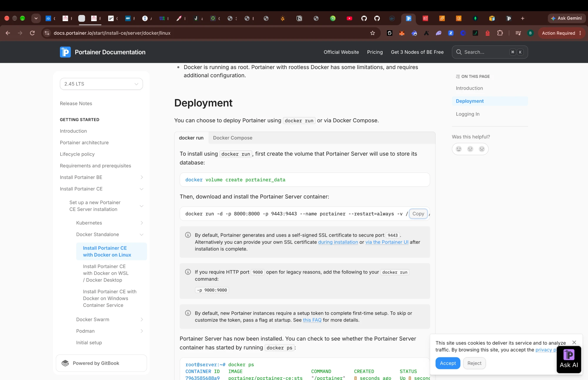
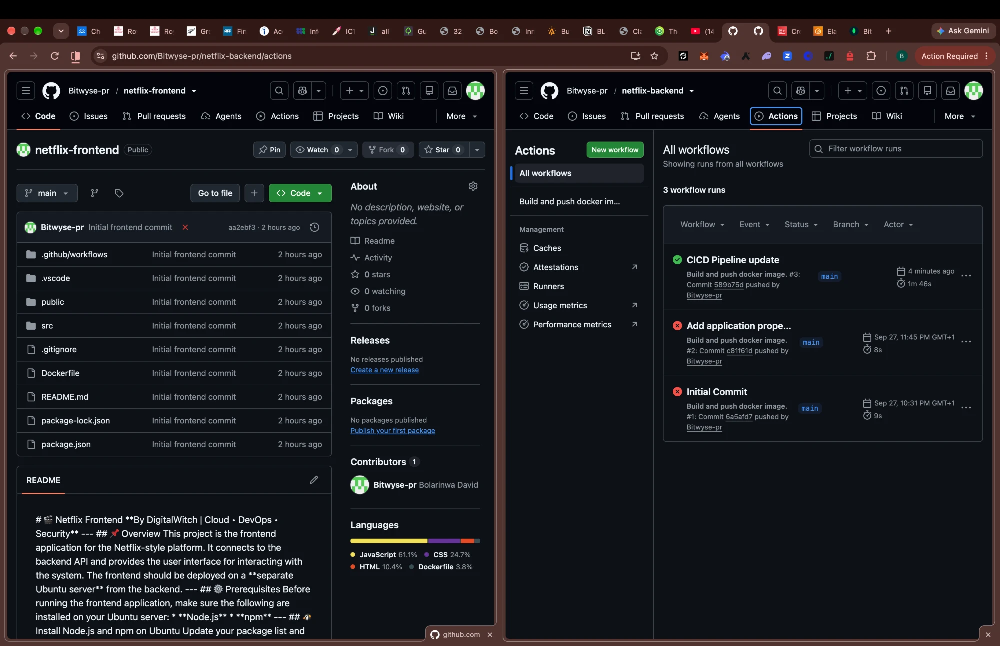
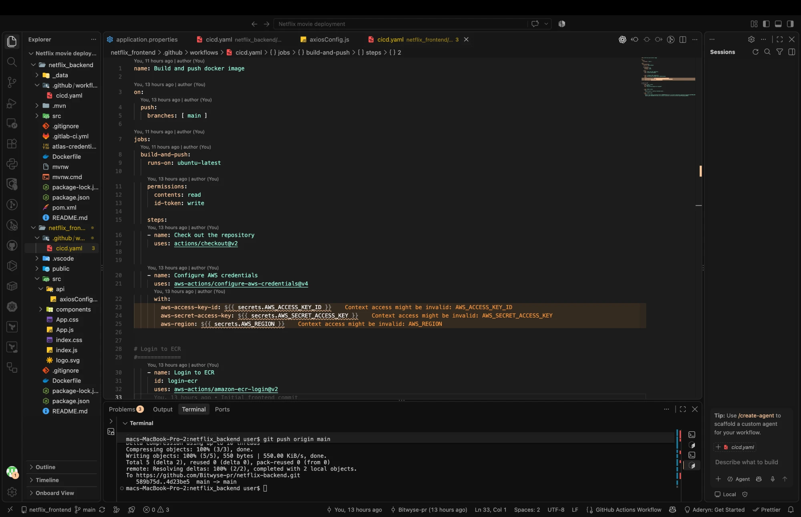
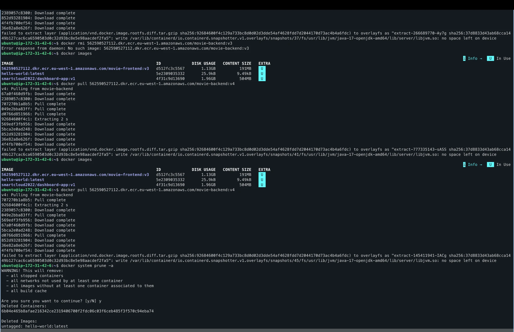
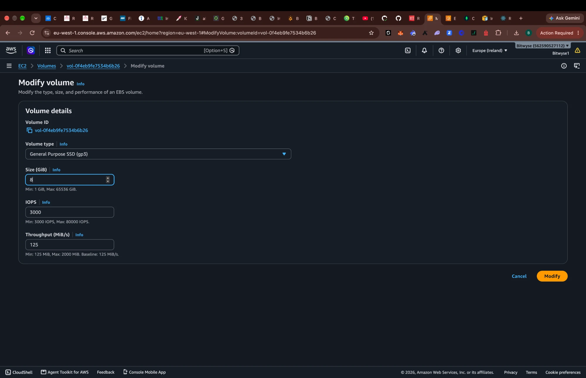
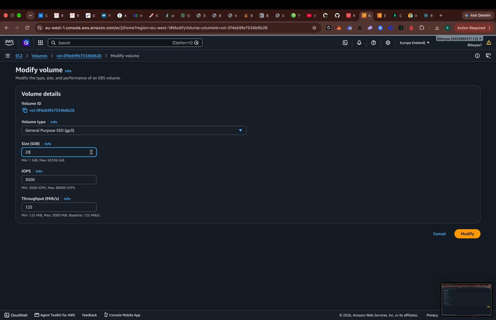
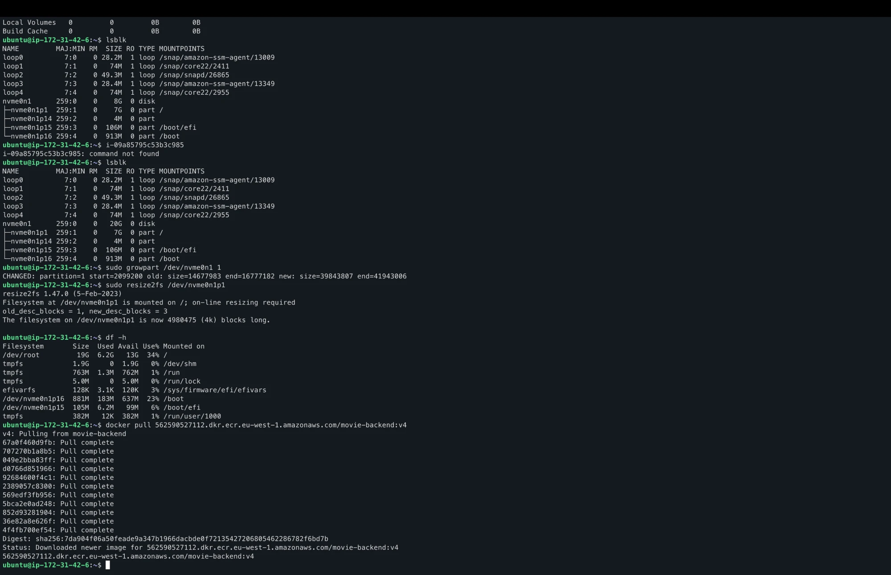
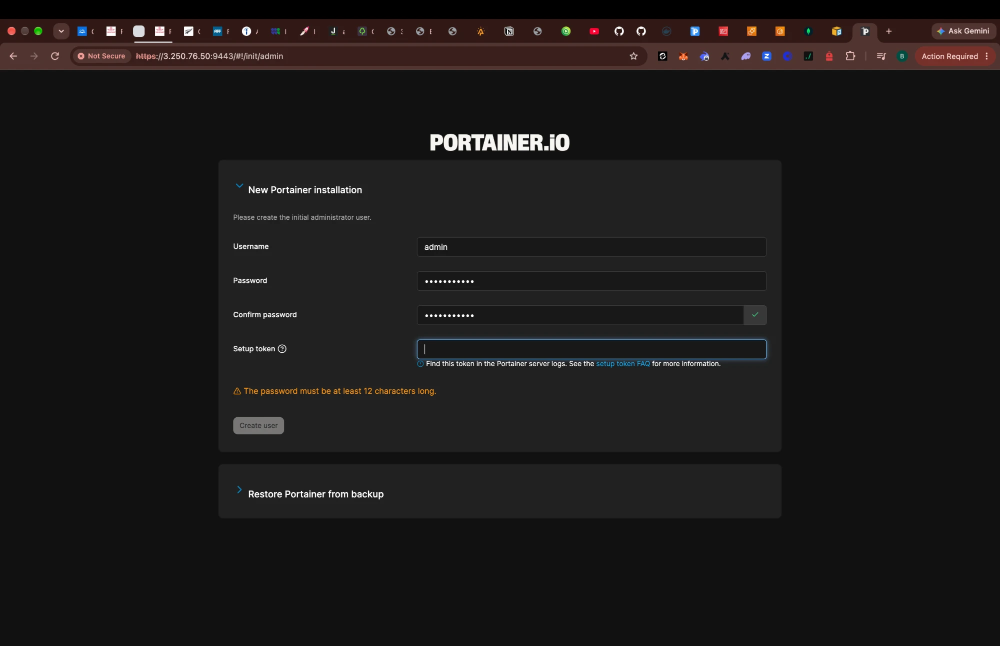
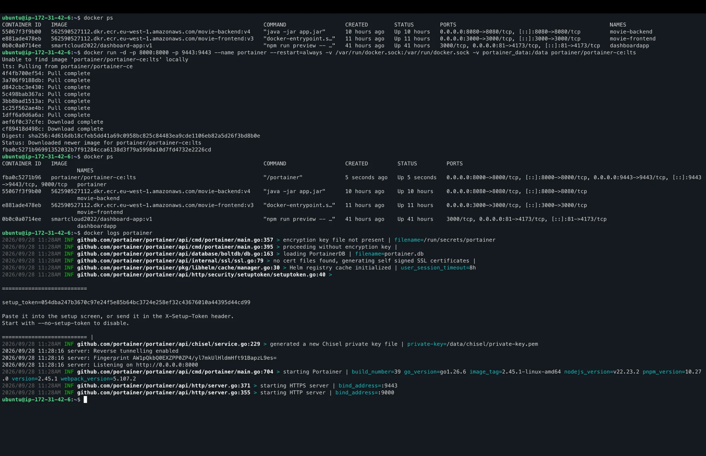
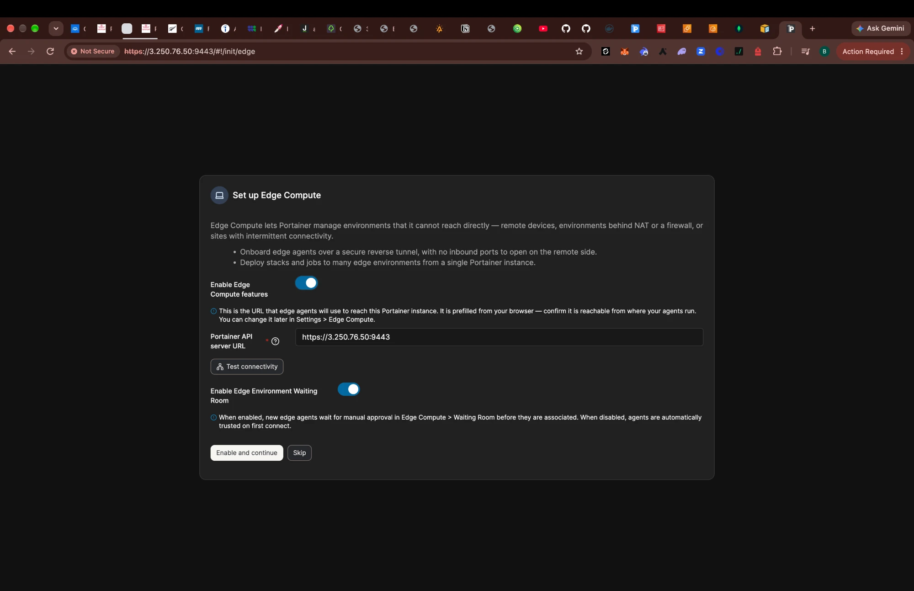

# Netflix Clone: CI/CD to Amazon ECR, Docker on EC2, Portainer

This is my write-up of deploying a two-tier Netflix-style app (React frontend, Spring Boot backend, MongoDB Atlas database). GitHub Actions builds each service into a Docker image and pushes it to **Amazon ECR**. An **EC2 Docker host** pulls the images and runs them, and **Portainer** manages the containers.

It covers the steps I followed, the errors I hit along the way, and how I fixed each one.

| Repo | Stack | Image in ECR | Port |
|---|---|---|---|
| [netflix-frontend](https://github.com/Bitwyse-pr/netflix-frontend) | React (Node 18) served with `serve` | `movie-frontend:v3` | 3000 |
| [netflix-backend](https://github.com/Bitwyse-pr/netflix-backend) | Java 17, Spring Boot, Maven | `movie-backend:v4` | 8080 |
| MongoDB Atlas (AWS) | Cluster0, database `movies` | n/a | 27017 (SRV) |


---

## Why I set up a proper deployment environment

I could have run `npm start` and `mvn spring-boot:run` on a server by hand. The organisations I work with need more than that:

- **Repeatability.** Every push to `main` produces the same versioned image (`v1`, `v2`, …) through the same steps. It doesn't depend on "what's installed on my laptop".
- **Traceability and rollback.** Each image tag maps to a GitHub run number and a commit. If `v4` breaks, I can redeploy `v3` in seconds because the image is still in ECR.
- **Separation of build and run.** GitHub's runners do the build and the server only runs containers, so no compilers or source code sit on production hosts.
- **Secrets out of code.** AWS keys and the database connection string live in GitHub Secrets rather than in the repo (see the lessons section for where I got this wrong at first).
- **Visibility for non-CLI teammates.** Portainer gives a web UI for container status, logs, restarts and resource use, so not everyone has to SSH in.
- **Portability.** The same images could move to ECS, EKS or another host without changes.

---

## Architecture

```mermaid
flowchart LR
    dev[Developer<br/>git push main] --> gh[GitHub Actions<br/>build-and-push]
    gh -- docker push vN --> ecr[(Amazon ECR<br/>movie-frontend / movie-backend)]
    ecr -- docker pull --> ec2[EC2 Ubuntu Docker host]
    subgraph ec2 [EC2 Docker host]
      fe[movie-frontend :3000]
      be[movie-backend :8080]
      pt[Portainer :9443]
    end
    user[Browser] --> fe
    fe -- axios http://EC2_IP:8080 --> be
    be -- mongodb+srv --> atlas[(MongoDB Atlas<br/>Cluster0 / movies)]
    pt -. manages via docker.sock .-> fe
    pt -. manages .-> be
```

Pipeline flow: **Build (CI) → Push (CD) → Deploy (CD)**

---

## 1. Repository setup

For both frontend and backend I cloned the starter repo, removed its Git history and started a fresh repository under my own account:

```bash
git clone https://github.com/digitalwitchdemo/netflix_backend.git
cd netflix_backend
rm -rf .git
git init
git config user.name "Bitwyse-pr"
git config user.email "<your-email>"
git add .
git commit -m "Initial Commit"
git branch -M main
git remote add origin https://github.com/Bitwyse-pr/netflix-backend.git
git push -u origin main
```

I did the same for `netflix_frontend` → `netflix-frontend`.

---

## 2. AWS setup

1. **ECR.** I created two private repositories in `eu-west-1`: `movie-frontend` and `movie-backend`.
2. **IAM user for CI.** I created a user with permission to push to ECR (for example the `AmazonEC2ContainerRegistryPowerUser` managed policy) and generated an access key for GitHub Actions.
3. **EC2 Docker host.** This is an Ubuntu instance with Docker installed. Its security group allows inbound:
   - `22` for SSH (my IP only)
   - `3000` for the frontend
   - `8080` for the backend API that the browser calls
   - `9443` for the Portainer UI (my IP only)
4. **MongoDB Atlas.** Cluster0 is hosted on AWS and holds the `movies` database. The EC2 public IP has to be on the Atlas **Network Access** list, or the backend can't connect.

---

## 3. CI/CD workflows (GitHub Actions to ECR)

Each repo has `.github/workflows/cicd.yaml`, which runs on every push to `main`.

### Backend: `netflix-backend/.github/workflows/cicd.yaml`

```yaml
name: Build and push docker image.

on:
  push:
    branches: [ main ]

jobs:
  build-and-push:
    runs-on: ubuntu-latest
    steps:
    - name: Check out the repository
      uses: actions/checkout@v2

    - name: Configure AWS credentials
      uses: aws-actions/configure-aws-credentials@v4
      with:
        aws-access-key-id: ${{ secrets.AWS_ACCESS_KEY_ID }}
        aws-secret-access-key: ${{ secrets.AWS_SECRET_ACCESS_KEY }}
        aws-region: ${{ secrets.AWS_REGION }}

    - name: Recreate application.properties
      run: |
        mkdir -p src/main/resources
        echo "${{ secrets.APP_PROPERTIES }}" > src/main/resources/application.properties

    - name: Login to ECR
      id: login-ecr
      uses: aws-actions/amazon-ecr-login@v2

    - name: Docker build
      run: docker build -t netflix_backend:latest .

    - name: Docker push
      run: |
        docker tag netflix_backend:latest <AWS_ACCOUNT_ID>.dkr.ecr.eu-west-1.amazonaws.com/movie-backend:v${GITHUB_RUN_NUMBER}
        docker push <AWS_ACCOUNT_ID>.dkr.ecr.eu-west-1.amazonaws.com/movie-backend:v${GITHUB_RUN_NUMBER}
```

### Frontend: `netflix-frontend/.github/workflows/cicd.yaml`

This is the same as the backend workflow, minus the `application.properties` step. It pushes `movie-frontend:v${GITHUB_RUN_NUMBER}`.

### Repository secrets

These are set under **Settings → Secrets and variables → Actions** in each repo:

| Secret | Frontend | Backend | Value |
|---|:---:|:---:|---|
| `AWS_ACCESS_KEY_ID` | ✅ | ✅ | IAM user access key |
| `AWS_SECRET_ACCESS_KEY` | ✅ | ✅ | IAM user secret |
| `AWS_REGION` | ✅ | ✅ | `eu-west-1` |
| `APP_PROPERTIES` | | ✅ | contents of `application.properties` (below) |

```properties
spring.data.mongodb.database=movies
spring.data.mongodb.uri=mongodb+srv://<user>:<password>@cluster0.xxxxx.mongodb.net
```

Using the run number as the tag gives every build its own version. That's why the backend is at `v4` and the frontend at `v3`: the backend had one more run.

---

## 4. Deploying on the EC2 Docker host

```bash
# 1. Authenticate Docker to ECR (the instance needs an IAM role or `aws configure` with ECR pull rights)
aws ecr get-login-password --region eu-west-1 \
  | docker login --username AWS --password-stdin <AWS_ACCOUNT_ID>.dkr.ecr.eu-west-1.amazonaws.com

# 2. Pull the images
docker pull <AWS_ACCOUNT_ID>.dkr.ecr.eu-west-1.amazonaws.com/movie-backend:v4
docker pull <AWS_ACCOUNT_ID>.dkr.ecr.eu-west-1.amazonaws.com/movie-frontend:v3

# 3. Run them
docker run -d --name movie-backend  --restart=always -p 8080:8080 \
  <AWS_ACCOUNT_ID>.dkr.ecr.eu-west-1.amazonaws.com/movie-backend:v4
docker run -d --name movie-frontend --restart=always -p 3000:3000 \
  <AWS_ACCOUNT_ID>.dkr.ecr.eu-west-1.amazonaws.com/movie-frontend:v3

# 4. Verify
docker ps
curl http://localhost:8080/api/v1/movies   # JSON list of movies from Atlas
```

The app is at `http://<EC2_PUBLIC_IP>:3000`, and the API at `http://<EC2_PUBLIC_IP>:8080/api/v1/movies`.

---

## 5. Managing the containers with Portainer

I followed the official [Portainer CE on Docker/Linux](https://docs.portainer.io/start/install-ce/server/docker/linux) guide:

```bash
docker volume create portainer_data
docker run -d -p 8000:8000 -p 9443:9443 --name portainer --restart=always \
  -v /var/run/docker.sock:/var/run/docker.sock \
  -v portainer_data:/data \
  portainer/portainer-ce:lts
```

Then I opened `https://<EC2_PUBLIC_IP>:9443`, created the admin user, skipped Edge Compute, and connected the local Docker environment. From Portainer I can see `movie-frontend`, `movie-backend` and `portainer` and manage them.



---

## 6. Errors I hit and how I fixed them

### Error 1: Pipeline failed in about 9 seconds with `Input required and not supplied: aws-region`



**What happened:** The first runs of both pipelines failed at *Configure AWS credentials*. Login, build and push were all skipped.

**Cause:** I hadn't created the repository secrets yet. `${{ secrets.AWS_REGION }}` resolved to an empty string, and the action treats that as missing input.

**Fix:** I added `AWS_ACCESS_KEY_ID`, `AWS_SECRET_ACCESS_KEY` and `AWS_REGION` under *Settings → Secrets and variables → Actions*, then re-ran the job.

**Gotcha:** Secrets are **per repository**. After adding them to the backend, the frontend's run #2 still failed with the same error until I added them there too. (GitHub organisation-level secrets avoid repeating this.)

---

### Error 2: The backend needs `application.properties`, but it shouldn't be in Git

**Cause:** Spring Boot reads the MongoDB URI from `src/main/resources/application.properties`. That file holds a database password, so it's in `.gitignore`. Without it on the runner, the image has no database config.

**Fix:** I stored the whole file as the `APP_PROPERTIES` secret and added a workflow step that recreates it before `docker build` (see section 3).

---

### Error 3: VS Code warns `Context access might be invalid: AWS_ACCESS_KEY_ID`



**Cause:** The GitHub Actions VS Code extension can't see which secrets exist in the repo, so it flags them.

**Fix:** Nothing to fix. This is a lint warning, not a real error, and it goes away once the extension is signed in and the secrets exist. The pipeline ran fine.

---

### Error 4: Frontend loaded but showed no movies

**Cause:** The React app calls the API via `src/api/axiosConfig.js`, and `baseURL` still pointed at the original author's server.

**Fix:** I set it to my EC2 host (commit *"Backend IP update"*):

```js
export default axios.create({
    baseURL: 'http://<EC2_PUBLIC_IP>:8080',
    headers: { 'Content-Type': 'application/json' },
});
```

Because React bakes this into the static bundle at **build time**, the frontend image has to be rebuilt (a new push → new `vN`) whenever the IP changes. An **Elastic IP** keeps the address stable across instance stop and start.

---

### Error 5: `docker pull` failed with `no space left on device`



```
failed to extract layer ... /usr/lib/jvm/java-17-openjdk-amd64/lib/server/libjvm.so: no space left on device
```

**Cause:** The instance had the default **8 GiB** root volume, with only a ~7 GiB root partition. The backend image is large because its Dockerfile uses full `ubuntu` plus JDK 17 plus Maven. With the frontend and another app's image already on disk, the pull couldn't finish extracting.

**What didn't work:**
- `docker rmi …/movie-backend:v3` returned `No such image` because it had never finished pulling.
- `docker system prune -a` freed some space, but not enough.

**Fix: grow the EBS volume and filesystem without downtime**

1. EC2 console → *Volumes* → select the root volume → *Modify* → change size from **8 to 20 GiB**.

   
   

2. On the instance, `lsblk` now shows the **disk** at 20G, but the **partition** is still 7G. The OS doesn't grow the partition by itself:

   ```bash
   lsblk                               # nvme0n1 20G, nvme0n1p1 still 7G
   sudo growpart /dev/nvme0n1 1        # grow partition 1 to fill the disk
   sudo resize2fs /dev/nvme0n1p1       # grow the ext4 filesystem (online)
   df -h                               # /dev/root 19G, 34% used
   ```

3. I re-ran `docker pull …/movie-backend:v4`, and this time it succeeded.

   

**Lesson:** Resizing a volume in AWS takes three steps: **the volume, then the partition, then the filesystem**. The console only does the first one.

---

### Error 6: Portainer wouldn't create the admin user



There were two blockers on the first-run screen:

1. **The password must be at least 12 characters long.** I picked a longer password.
2. **Setup token.** Recent Portainer versions (2.45 LTS) require a one-time setup token before you can create the first admin, so strangers can't claim a freshly exposed instance. The token is printed in the container logs:

   ```bash
   docker logs portainer     # look for: setup_token=...
   ```

   

After I pasted the token, **Create user** was enabled. On the next screen (*Set up Edge Compute*) I clicked **Skip**, because this is a single standalone Docker host that Portainer manages directly through `docker.sock`.



---

### Warnings worth knowing about (not failures)

- **`Node.js 20 is deprecated`**: `actions/checkout@v2` and `configure-aws-credentials@v4` target Node 20. Upgrade to `actions/checkout@v4` or later.
- **`ubuntu-latest will migrate to Ubuntu 26`**: pin `runs-on: ubuntu-24.04` if you want predictable runners.

---

## 7. What I'd improve next

- **Security:** Never commit credential files. Keep `application.properties` and `*.env` in `.gitignore` and rotate anything that was ever pushed.
- **Security:** Don't bake the Mongo URI into the image. Pass it at runtime with `docker run -e SPRING_DATA_MONGODB_URI=...` or AWS Secrets Manager, because anyone who can pull the image can currently read it.
- **Security:** Replace long-lived AWS access keys with **GitHub OIDC** and an IAM role (`role-to-assume`). The frontend workflow already has `id-token: write` ready for this.
- **Smaller images:** Use a multi-stage backend Dockerfile (`maven:3-eclipse-temurin-17` to build, `eclipse-temurin:17-jre` to run). This takes the image from over 1 GB to about 200 MB, which would have avoided Error 6.
- **Automated deploy step:** SSH or SSM from Actions to pull and restart the new tag, or use Portainer webhooks, so deploy becomes CD too.
- **Stable address and HTTPS:** Elastic IP, a domain, and a reverse proxy (Nginx or Caddy) with TLS in front of ports 3000 and 8080.
- **Access control:** Restrict ports 9443 and 22 to my IP only.

---

*Built by Bolarinwa David ([@Bitwyse-pr](https://github.com/Bitwyse-pr)).*
